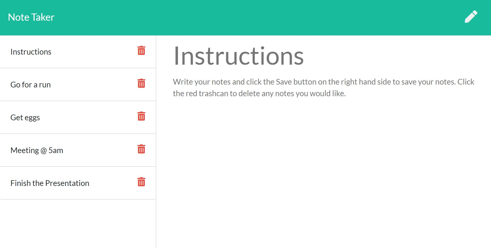

# Note Taker

### Table of contents

- [Links](##Links)
- [Aim](##Aim)
- [Prerequisites](##Prerequisites)
- [Collaborators](##collaborators)
- [Install Guide](##Install)
- [Pictures](##Pictures)

## Links

- [GitHub Repository](https://github.com/ChrisOnions/Note_Taker)

- [Deployed on heroku](https://shielded-escarpment-72538.herokuapp.com/)

## Aim

To create an application called Note Taker that can be used to write and save notes. This application will use an Express.js back end and will save and retrieve note data from a JSON file. Deploy the entire application to Heroku.

## Prerequisites

- Javascript
- React
- Express
- Node.js
- NPM
- Heroku

## Collaborators

If you would like to colaborate on this project or would like to know more please see my contacts for information oh how to reach me.

## Install

Clone Repository - (From github Repository)

NPM install - (To install all required packages from package.json)

Node Server.js - (Starts program)

Visist http://localhost:8080/

## Pictures

